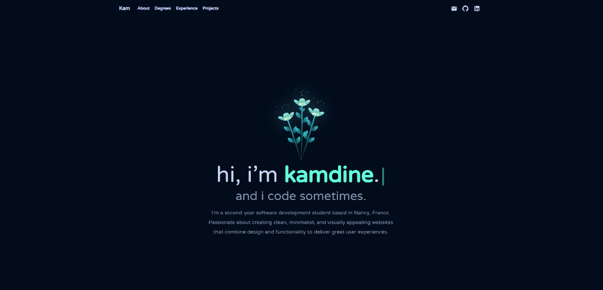

<div align="center">

# Portfolio

Welcome to my portfolio!

</div>



## 🚀 Installation and Setup

Since this project is a bit old, a specific command is required to install dependencies.

1.  Clone the repository:
    ```bash
    git clone https://github.com/your-username/your-repo.git
    cd portfolio
    ```

2.  Install dependencies with the legacy option:
    ```bash
    npm install --legacy-peer-deps
    ```

3.  Start the project:
    ```bash
    npm start
    ```

## 🎨 Credits and Inspiration

This portfolio was inspired by the work of **Gazi Jarin**.
You can find their original project here: [https://github.com/gazijarin/Gazi](https://github.com/gazijarin/Gazi)
